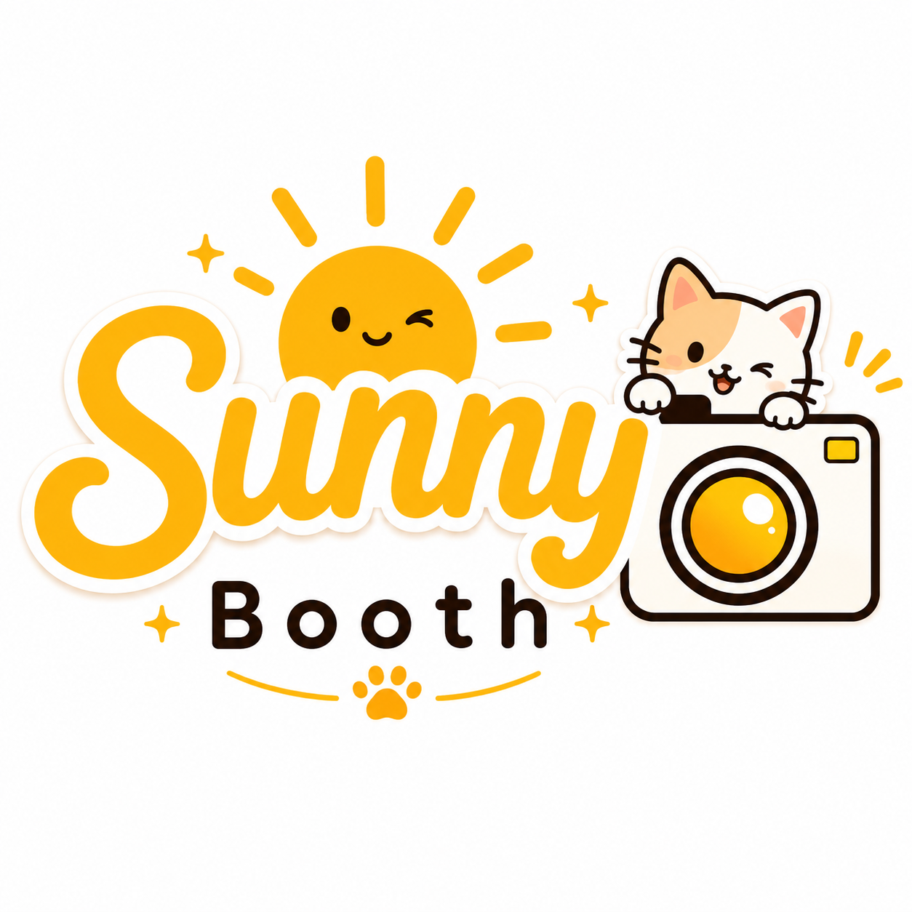
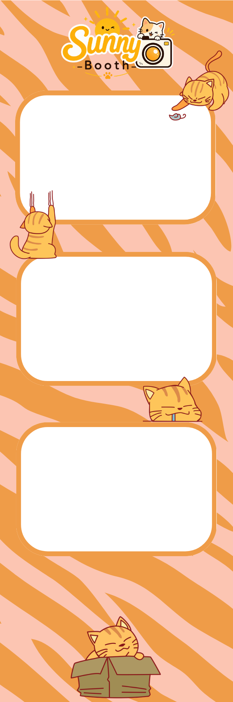
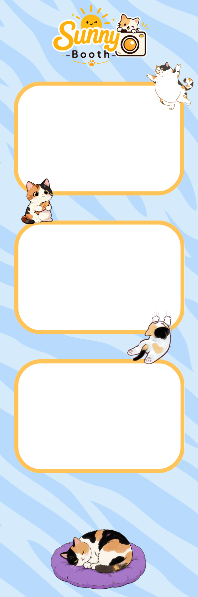
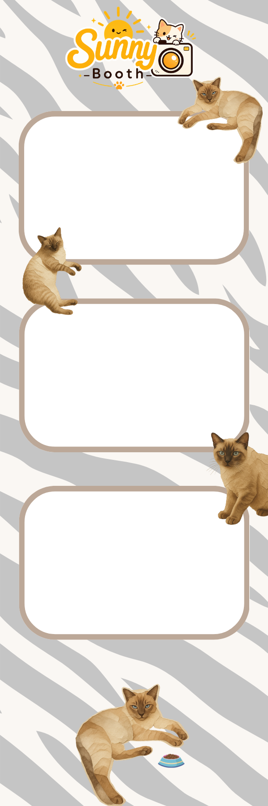

# SunnyBooth

  

SunnyBooth is a modern, interactive cat-themed online photobooth built for playful photo strips, polished templates, and quick browser-based sharing.

## Live Demo

Try SunnyBooth here:

**https://sunnybooth.vercel.app**

## Preview

  
  
  

## Features

- Browser-based camera photobooth
- Layout selection before capture
- SunnyBooth custom cat templates
- Classic photo strip layouts
- Live strip preview while capturing
- Photo review and retake flow
- Upload pictures from device
- Photo reposition, resize, and rotate controls
- Filters and image adjustments
- Custom frame colors and frame backgrounds for classic strips
- PNG, JPG, high-resolution export, and print support
- Mobile, tablet, and desktop responsive UI

## Tech Stack

- TypeScript
- Next.js App Router
- React
- Tailwind CSS
- Framer Motion
- HTML5 Canvas
- WebRTC MediaDevices API
- Lucide React
- Vercel

## Source Code

SunnyBooth is proprietary software.

The production source code, templates, rendering logic, camera flow, and editor implementation are private and are not available for public use, copying, redistribution, or modification.

## Copyright

Copyright © 2026 Jesper Alicando. All rights reserved.

